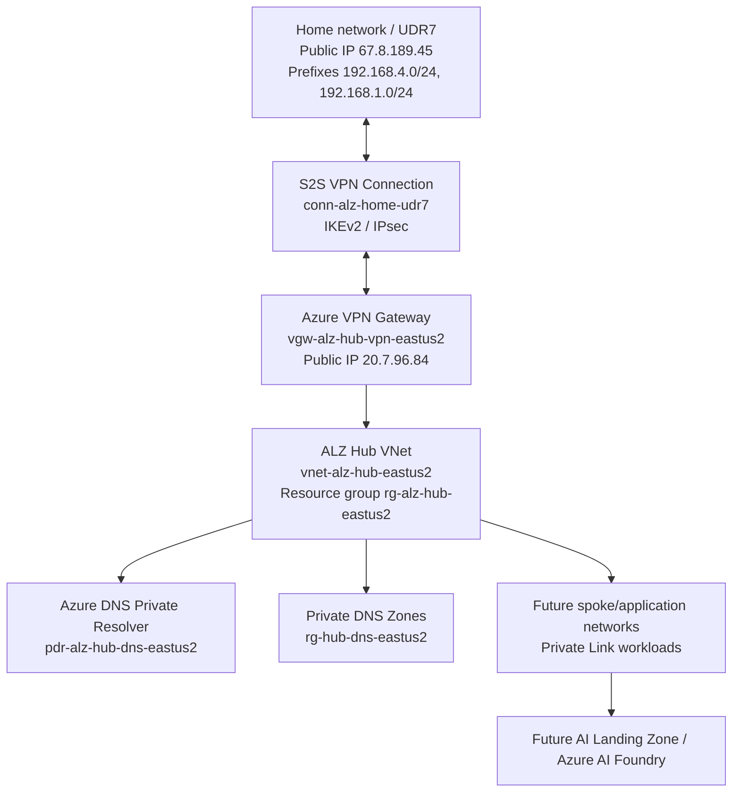

# ALZ Scenario 6 Hub-Spoke Implementation Runbook

Date: 2026-04-25

Repository: `fabrikam-landingzones/alz-terraform-accelerator`

Branch: `alz-custom`

Current validated checkpoint: `alz-vpn-connected-working`

## 1. Purpose

This document reconstructs and documents the Azure Landing Zones implementation performed for a Scenario 6 style hub-and-spoke architecture using Terraform.

The intended design is:

- Azure Landing Zones platform deployment using Terraform and the ALZ IaC Accelerator.
- Hub-and-spoke connectivity model.
- Azure Firewall removed from the design.
- Private Link ready foundation using Private DNS zones.
- Azure DNS Private Resolver enabled.
- Site-to-Site VPN connectivity between home/on-premises network and Azure.
- Terraform-managed continuous delivery through GitHub Actions.

The next planned phase is to deploy an AI Landing Zone for Azure AI Foundry using Terraform, based on the official Azure Verified Module pattern:

`https://github.com/Azure/terraform-azurerm-avm-ptn-aiml-landing-zone`

## 2. Official References

The implementation aligns with the Microsoft-recommended Infrastructure-as-Code approach for platform landing zones. Microsoft documentation describes the ALZ IaC Accelerator as the recommended approach to deploy and manage the platform landing zone, using Bicep or Terraform with Azure Verified Modules, and preparing version control plus CI/CD.

References:

- Azure Landing Zone implementation options: `https://learn.microsoft.com/en-us/azure/cloud-adoption-framework/ready/landing-zone/implementation-options`
- Azure ALZ Terraform AVM module: `https://github.com/Azure/terraform-azurerm-avm-ptn-alz`
- AI/ML Landing Zone Terraform module: `https://github.com/Azure/terraform-azurerm-avm-ptn-aiml-landing-zone`
- Terraform Registry module for AI Landing Zone: `https://registry.terraform.io/modules/Azure/avm-ptn-aiml-landing-zone/azurerm/latest`

The AI Landing Zone module currently requires Terraform `>= 1.9, < 2.0` and providers including `azurerm ~> 4.0` and `azapi ~> 2.4`. Its required inputs include `location`, `resource_group_name`, and `vnet_definition`.

## 3. Current Target Architecture

The implemented target architecture is:



## 4. Directory Model

Two important local directories were involved.

### 4.1 Source accelerator directory

Path:

```text
C:\Users\renatocamara\projects\landingzone\alz\alz-terraform-accelerator
```

Purpose:

- This is the ALZ IaC Accelerator source/tooling repository.
- It contains accelerator templates, bootstrap modules, starter modules, documentation, and generated `output`.
- It is not the final day-to-day deployment repository.
- It was used to run the accelerator command and generate the deployment-ready Terraform repository content.

Local evidence:

```text
output\.alz-version-data.json
bootstrapVersion = v7.1.0
starterVersion   = v15.4.0
lastUpdated      = 2026-03-17T13:57:25Z
```

Remotes observed:

```text
origin = https://github.com/renatocamara/alz-terraform-accelerator.git
org    = https://github.com/fabrikam-landingzones/alz-terraform-accelerator.git
```

Latest local commit observed:

```text
9d58cf3 Move MDFC export and security contact params to policy_default_values (#304)
```

### 4.2 Deployment repository directory

Path:

```text
C:\Users\renatocamara\projects\landingzone\alz\alz-terraform-accelerator-deploy
```

Purpose:

- This is the deployment repository generated from the accelerator output.
- This is the repository that contains the Terraform root module, ALZ library, custom configuration, and GitHub Actions workflow.
- This is the repository connected to GitHub Actions and used to deploy the platform landing zone.
- This is the repository to share with the client for repeatable implementation.

Remote observed:

```text
origin = https://github.com/fabrikam-landingzones/alz-terraform-accelerator.git
```

Current branch:

```text
alz-custom
```

Current validated commit:

```text
c75d6ad Add home UDR7 S2S VPN connection
```

Current validated tag:

```text
alz-vpn-connected-working
```

## 5. Why A Separate Deployment Directory Exists

This was the main confusing point, so this section is intentionally explicit.

The official ALZ accelerator repository is a generator and bootstrap tool. It helps prepare:

- Terraform platform landing zone root module.
- Bootstrap resources for GitHub Actions or Azure DevOps.
- CI/CD pipeline definitions.
- Remote state configuration.
- Starter module content.

After the accelerator runs, the generated deployment assets need to live in a normal Git repository that the customer owns and operates. In this implementation, that repository is represented locally by:

```text
C:\Users\renatocamara\projects\landingzone\alz\alz-terraform-accelerator-deploy
```

In other words:

```text
alz-terraform-accelerator
  = source/generator/tooling repository

alz-terraform-accelerator-deploy
  = generated customer deployment repository
```

The deployment repository is the place where future changes are made, reviewed, committed, pushed, and deployed through GitHub Actions.

## 6. Reconstructed Initial Setup Flow

The exact interactive prompt transcript is not available in the current working files. The following flow is reconstructed from the local directories, Git remotes, generated output, GitHub Actions resources, and resulting Terraform configuration.

### Step 1: Clone or prepare the ALZ IaC Accelerator

Working directory:

```powershell
cd C:\Users\renatocamara\projects\landingzone\alz\alz-terraform-accelerator
```

This directory contained the official accelerator code and generated the `output` folder.

### Step 2: Run the ALZ accelerator command

The accelerator command was run from:

```text
C:\Users\renatocamara\projects\landingzone\alz\alz-terraform-accelerator
```

The command used was the accelerator's PowerShell deployment command, referred to during the implementation as:

```powershell
Deploy-Accelerator
```

During the prompts, the implementation selected a Terraform-based ALZ deployment with GitHub as the CI/CD platform.

Important choices inferred from the resulting environment:

- IaC language: Terraform.
- VCS / CI-CD: GitHub and GitHub Actions.
- Architecture: hub-and-spoke platform landing zone.
- Primary region: `eastus2`.
- Connectivity subscription: `2a43354d-ac7c-44a4-9a65-3cc7868cdbdb`.
- Management subscription: `1e21d1d0-beb6-4e0e-bb8b-488fd7d39f76`.
- Deployment branch eventually used: `alz-custom`.
- GitHub organization: `fabrikam-landingzones`.
- GitHub repository: `alz-terraform-accelerator`.

### Step 3: Bootstrap assets were generated

Local generated accelerator metadata:

```text
C:\Users\renatocamara\projects\landingzone\alz\alz-terraform-accelerator\output\.alz-version-data.json
```

Observed version data:

```json
{
  "bootstrapVersion": "v7.1.0",
  "starterVersion": "v15.4.0",
  "lastUpdated": "2026-03-17T13:57:25Z"
}
```

This indicates the accelerator generated bootstrap and starter module content under:

```text
output\bootstrap\v7.1.0
output\starter\v15.4.0
```

### Step 4: A separate deployment repository was created

The generated deployment content was placed into:

```text
C:\Users\renatocamara\projects\landingzone\alz\alz-terraform-accelerator-deploy
```

This directory contains the Terraform files now used for deployment:

```text
main.config.tf
main.connectivity.tf
main.management.groups.tf
main.management.resources.tf
main.resource.groups.tf
locals.tf
variables.tf
platform-landing-zone.auto.tfvars
terraform.tf
.github\workflows\cd.yaml
```

### Step 5: GitHub repository was connected

The deployment directory was connected to:

```text
https://github.com/fabrikam-landingzones/alz-terraform-accelerator.git
```

This is the repository that GitHub Actions uses.

### Step 6: GitHub Actions variables and environments were used

The active workflow is:

```text
.github\workflows\cd.yaml
```

The workflow runs on pushes to:

```text
alz-custom
```

It uses two GitHub environments:

```text
fabalz-fabmgmt-plan
fabalz-fabmgmt-apply
```

It authenticates to Azure using OIDC:

```yaml
ARM_USE_AZUREAD: true
ARM_USE_OIDC: true
```

It reads Azure and backend configuration from GitHub Actions variables:

```text
AZURE_CLIENT_ID
AZURE_SUBSCRIPTION_ID
AZURE_TENANT_ID
BACKEND_AZURE_RESOURCE_GROUP_NAME
BACKEND_AZURE_STORAGE_ACCOUNT_NAME
BACKEND_AZURE_STORAGE_ACCOUNT_CONTAINER_NAME
```

It reads the S2S VPN pre-shared key from GitHub Actions secret:

```text
VPN_SHARED_KEY
```

## 7. Current Implemented Configuration

Primary region:

```hcl
starter_locations = ["eastus2"]
```

Connectivity model:

```hcl
connectivity_type = "hub_and_spoke_vnet"
```

Feature state:

```hcl
ddos_protection_plan_enabled                    = false
primary_firewall_enabled                        = false
primary_virtual_network_gateway_vpn_enabled     = true
primary_private_dns_zones_enabled               = true
primary_private_dns_auto_registration_zone_enabled = true
primary_private_dns_resolver_enabled            = true
primary_bastion_enabled                         = false
```

Important implemented resources:

```text
Connectivity resource group: rg-alz-hub-eastus2
Hub VNet:                    vnet-alz-hub-eastus2
Private DNS RG:              rg-hub-dns-eastus2
DNS Private Resolver:        pdr-alz-hub-dns-eastus2
VPN Gateway:                 vgw-alz-hub-vpn-eastus2
VPN Gateway public IP:       20.7.96.84
Local Network Gateway:       lng-alz-home-udr7
S2S VPN Connection:          conn-alz-home-udr7
Home public IP:              67.8.189.45
Home prefixes:               192.168.4.0/24, 192.168.1.0/24
```

VPN configuration:

```text
Type:                               IPsec
Protocol:                           IKEv2
use_policy_based_traffic_selectors: false
IKE encryption:                     AES256
IKE integrity:                      SHA256
DH group:                           DHGroup14
IPsec encryption:                   AES256
IPsec integrity:                    SHA256
PFS group:                          None
SA lifetime:                        3600
SA data size:                       102400000
```

Validated state:

```text
Azure VPN connection status: Connected
UDR7 VPN status:             Online
Terraform plan:              No changes
```

## 8. Checkpoints and Tags

The following Git tags were created as safe rollback/reference points:

```text
alz-baseline-working
alz-private-dns-working
alz-private-dns-resolver-working
alz-vpn-connected-working
```

Current validated tag:

```text
alz-vpn-connected-working -> c75d6ad
```

## 9. Important Stabilization Changes Made

The implementation did not converge in a single run. Several incremental changes were required because the environment already had manually created resources and because some Scenario 6 defaults assumed resources that were intentionally removed.

### 9.1 Azure Firewall removed

Azure Firewall was intentionally disabled:

```hcl
primary_firewall_enabled = false
```

Related firewall resource names remain in the configuration as naming templates, but firewall creation is disabled.

### 9.2 DDoS policy wiring removed

DDoS was disabled:

```hcl
ddos_protection_plan_enabled = false
ddos_protection_plan_id      = null
```

The DDoS policy assignments were also removed from the custom archetype overrides because policy wiring still referenced a DDoS plan that was not deployed.

### 9.3 New ALZ hub created instead of adopting old manual hub

The old manual hub was:

```text
rg-hub-eastus2
vnet-hub-eastus2
```

The ALZ-managed hub was moved to:

```text
rg-alz-hub-eastus2
vnet-alz-hub-eastus2
```

This avoids accidental coupling to manually created resources and allows the old hub to be retired later after dependency validation.

### 9.4 Private DNS VNet links recreated for the new hub

Private DNS zone links originally pointed to the old manual VNet. Azure does not allow changing a Private DNS virtual network link to point to a different VNet in place.

To solve this:

- Regular Private Link zone links were renamed using a VNet-specific link name template.
- The auto-registration link for `eastus2.azure.local` was deleted and recreated pointing to the new ALZ hub VNet.

### 9.5 VPN shared key moved to GitHub Secret

The S2S VPN pre-shared key is not committed to Git.

Terraform variable:

```hcl
variable "vpn_shared_key" {
  type      = string
  default   = null
  sensitive = true
}
```

GitHub Actions secret:

```text
VPN_SHARED_KEY
```

Workflow environment variable:

```yaml
TF_VAR_vpn_shared_key: "${{ secrets.VPN_SHARED_KEY }}"
```

## 10. Known Gaps and Additional Considerations

Before considering the ALZ platform complete for client handoff, address the following items.

### 10.1 Old manual hub cleanup

Do not delete `rg-hub-eastus2` yet.

First inventory:

- Resources inside `rg-hub-eastus2`.
- VNet peerings on `vnet-hub-eastus2`.
- Private DNS links still pointing to `vnet-hub-eastus2`.
- Route tables or UDRs referencing old gateway/firewall resources.
- Private endpoints or workloads depending on old DNS/VNet paths.
- Any scripts, documentation, or router configuration still referencing old Azure VPN public IP `20.36.238.15`.

Only delete the old hub after confirming no dependencies remain.

### 10.2 Private DNS policy assignment

`Deploy-Private-DNS-Zones` was temporarily removed earlier to stabilize deployment while Private DNS zones were disabled or not yet present.

Now that Private DNS is deployed and linked to the new hub VNet, revisit whether this policy assignment should be restored.

Decision needed:

- Restore the ALZ policy assignment if the client wants policy-driven Private DNS zone deployment.
- Keep it removed if DNS is intentionally managed by the platform Terraform module only.

### 10.3 Monitoring and DCRs

Some data collection rules were temporarily reduced.

Current known DCR posture:

- `vm_insights` remained enabled.
- `change_tracking` was disabled.
- `defender_sql` was disabled.

Decision needed:

- Re-enable and validate `change_tracking` if required.
- Re-enable and validate `defender_sql` if required.
- Confirm Log Analytics and diagnostic settings meet client requirements.

### 10.4 Azure Firewall removal implications

Removing Azure Firewall is acceptable if it is a deliberate design choice, but the client must understand the consequences:

- No central Azure Firewall inspection point.
- No Azure Firewall DNS proxy.
- No Azure Firewall threat intelligence filtering.
- No central firewall policy enforcement.

Alternative controls should be confirmed:

- NSGs.
- UDRs only where required.
- Private Endpoints and Private DNS.
- Defender for Cloud.
- Workload-level controls.
- Optional third-party NVA if required later.

### 10.5 AI Landing Zone network integration

The AI Landing Zone should be planned as an application landing zone that consumes the platform foundation.

Key decisions before deployment:

- Deploy AI Landing Zone into a new spoke VNet or bring an existing VNet.
- Confirm address space does not overlap with:
  - `10.0.0.0/22` hub space.
  - `192.168.4.0/24` home network.
  - `192.168.1.0/24` home network.
- Decide whether AI Foundry access should be private-only.
- Confirm required Private DNS zones are present or can be linked.
- Confirm whether APIM, Application Gateway, jump VM, monitoring, and private endpoints are required by the selected AI pattern.
- Confirm whether the module should use BYO VNet. The official AI Landing Zone module supports `vnet_definition.existing_byo_vnet`.

### 10.6 Terraform state and secrets

The VPN shared key will exist in Terraform state as part of the VPN connection resource. This is normal for this resource type but must be protected.

Confirm:

- Backend storage account access is restricted by RBAC.
- GitHub Actions uses OIDC and not long-lived Azure secrets.
- GitHub Actions artifact retention is acceptable for the client's security requirements.
- `VPN_SHARED_KEY` secret exists and is maintained.

## 11. Recommended Next Steps

Recommended order:

1. Freeze the current ALZ checkpoint as the stable client baseline.
2. Inventory old manual hub `rg-hub-eastus2`.
3. Decide whether to restore `Deploy-Private-DNS-Zones` policy assignment.
4. Decide whether to re-enable `change_tracking` and `defender_sql` DCRs.
5. Confirm final network and DNS requirements for the AI Landing Zone.
6. Create a separate Terraform deployment area for the AI Landing Zone.
7. Integrate AI Landing Zone with the ALZ hub-spoke network using spoke VNet peering and Private DNS links.
8. Validate AI Foundry private connectivity from:
   - Azure workloads.
   - Home network over S2S VPN, if required.

## 12. Client Explanation: What Happened In Simple Terms

The implementation began by using the official Azure Landing Zones Terraform Accelerator. That repository is not meant to be the permanent customer deployment repository. It is a generator and bootstrap tool.

The accelerator generated a deployment-ready Terraform repository. That generated repository was placed into:

```text
C:\Users\renatocamara\projects\landingzone\alz\alz-terraform-accelerator-deploy
```

From that point onward, all meaningful implementation work happened in the deployment repository. This includes:

- Terraform configuration changes.
- ALZ customizations.
- Git commits.
- GitHub Actions deployment workflow.
- Tags/checkpoints.
- Private DNS enablement.
- DNS resolver enablement.
- VPN gateway and S2S VPN connection.

This separation is expected and healthy:

- The accelerator repository helps create the starting point.
- The deployment repository is the client-owned platform codebase.

## 13. Current Completion Statement

As of this checkpoint, the ALZ platform foundation is functional for the core stated goal:

- Hub-and-spoke VNet model is active.
- Azure Firewall is removed.
- Private DNS zones are deployed.
- Azure DNS Private Resolver is deployed.
- S2S VPN from home/UDR7 to Azure is connected.
- Terraform state matches deployed infrastructure with no pending changes.

Remaining work is controlled cleanup, governance restoration, monitoring decisions, and AI Landing Zone deployment planning.
