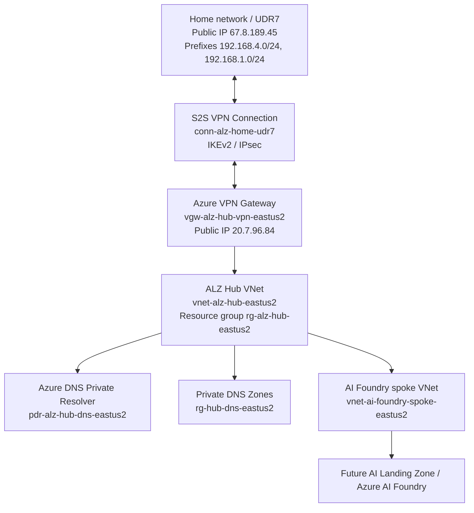

# ALZ Scenario 6 Hub-Spoke Implementation Runbook

Date: 2026-04-25

Repository: `fabrikam-landingzones/alz-terraform-accelerator`

Branch: `alz-custom`

Current validated checkpoint: `alz-scenario6-ai-spoke-working`

## 1. Purpose

This document reconstructs and documents the Azure Landing Zones implementation performed for a Scenario 6 style hub-and-spoke architecture using Terraform.

The intended design is:

- Azure Landing Zones platform deployment using Terraform and the ALZ IaC Accelerator.
- Hub-and-spoke connectivity model.
- Azure Firewall removed from the design.
- Private Link ready foundation using Private DNS zones.
- Azure DNS Private Resolver enabled.
- Site-to-Site VPN connectivity between home/on-premises network and Azure.
- Terraform-managed continuous delivery through GitHub Actions.

The next planned phase is to deploy an AI Landing Zone for Azure AI Foundry using Terraform, based on the official Azure Verified Module pattern:

`https://github.com/Azure/terraform-azurerm-avm-ptn-aiml-landing-zone`

## Operator Guidance for Beginner Walkthroughs

This runbook is intended to be used while guiding a client who may not have prior experience with Terraform, Git, or GitHub. Do not ask the client to run a command until the current working directory, expected result, and next decision point are clear.

Use this format when presenting each command live:

```text
Where to run:
<local PowerShell path, GitHub UI page, or Azure Portal page>

Command or action:
<exact command or exact UI action>

What it does:
<plain-language explanation>

Expected result:
<success message, visible resource, GitHub run status, or Terraform output>

Before moving on:
<condition that must be true before continuing>
```

Important rules for the client session:

- Run PowerShell commands from the directory shown before the command.
- Do not run `terraform apply` locally while a GitHub Actions Terraform run is active.
- Do not commit secrets such as VPN pre-shared keys into Git.
- Treat `terraform plan` as the review step and `terraform apply` as the change step.
- If Terraform reports a state lock, stop and confirm no other Terraform process or GitHub Actions run is active before unlocking.
- If Azure RBAC is changed, allow a few minutes for permission propagation before rerunning the pipeline.

Primary local working directories:

```text
ALZ accelerator source/tooling:
C:\Users\renatocamara\projects\landingzone\alz\alz-terraform-accelerator

Terraform deployment repository:
C:\Users\renatocamara\projects\landingzone\alz\alz-terraform-accelerator-deploy
```

Critical execution sequence:

| Step | Where | Action | Expected result | Continue only when |
| --- | --- | --- | --- | --- |
| 1 | Local PowerShell | Install/validate tools with `git --version`, `az version`, `terraform version`, `gh --version`, `pwsh --version` | Each tool returns a version | No command is missing |
| 2 | Azure / GitHub | Confirm tenant, subscription, and GitHub organization access | User can create Azure RBAC assignments and GitHub repos/environments | Required permissions are confirmed |
| 3 | ALZ accelerator source directory | Run `Deploy-Accelerator` | Terraform deployment assets are generated under `output` | Generated files exist |
| 4 | Deployment repository directory | Initialize Git, commit, and push to `alz-custom` | GitHub repository contains the generated Terraform code | Branch exists in GitHub |
| 5 | GitHub repository settings | Configure environments, variables, and secrets | `fabalz-fabmgmt-plan`, `fabalz-fabmgmt-apply`, variables, and `VPN_SHARED_KEY` exist | Plan/apply identities and backend values are correct |
| 6 | GitHub Actions | Run workflow on `alz-custom` | Plan and apply jobs run | Apply succeeds or the error is understood |
| 7 | Local PowerShell / Azure CLI | Validate Azure resources and management group placement | Resources and subscriptions are visible in expected locations | Terraform plan returns `No changes` |
| 8 | Deployment repository directory | Create a Git checkpoint tag | Tag is pushed to GitHub | Tag appears in GitHub |

## 2. Official References

The implementation aligns with the Microsoft-recommended Infrastructure-as-Code approach for platform landing zones. Microsoft documentation describes the ALZ IaC Accelerator as the recommended approach to deploy and manage the platform landing zone, using Bicep or Terraform with Azure Verified Modules, and preparing version control plus CI/CD.

References:

- Azure Landing Zone implementation options: `https://learn.microsoft.com/en-us/azure/cloud-adoption-framework/ready/landing-zone/implementation-options`
- Azure ALZ Terraform AVM module: `https://github.com/Azure/terraform-azurerm-avm-ptn-alz`
- AI/ML Landing Zone Terraform module: `https://github.com/Azure/terraform-azurerm-avm-ptn-aiml-landing-zone`
- Terraform Registry module for AI Landing Zone: `https://registry.terraform.io/modules/Azure/avm-ptn-aiml-landing-zone/azurerm/latest`

The AI Landing Zone module currently requires Terraform `>= 1.9, < 2.0` and providers including `azurerm ~> 4.0` and `azapi ~> 2.4`. Its required inputs include `location`, `resource_group_name`, and `vnet_definition`.

## 3. Current Target Architecture

The implemented target architecture is:



## 4. Directory Model

Two important local directories were involved.

### 4.1 Source accelerator directory

Path:

```text
C:\Users\renatocamara\projects\landingzone\alz\alz-terraform-accelerator
```

Purpose:

- This is the ALZ IaC Accelerator source/tooling repository.
- It contains accelerator templates, bootstrap modules, starter modules, documentation, and generated `output`.
- It is not the final day-to-day deployment repository.
- It was used to run the accelerator command and generate the deployment-ready Terraform repository content.

Local evidence:

```text
output\.alz-version-data.json
bootstrapVersion = v7.1.0
starterVersion   = v15.4.0
lastUpdated      = 2026-03-17T13:57:25Z
```

Remotes observed:

```text
origin = https://github.com/renatocamara/alz-terraform-accelerator.git
org    = https://github.com/fabrikam-landingzones/alz-terraform-accelerator.git
```

Latest local commit observed:

```text
9d58cf3 Move MDFC export and security contact params to policy_default_values (#304)
```

### 4.2 Deployment repository directory

Path:

```text
C:\Users\renatocamara\projects\landingzone\alz\alz-terraform-accelerator-deploy
```

Purpose:

- This is the deployment repository generated from the accelerator output.
- This is the repository that contains the Terraform root module, ALZ library, custom configuration, and GitHub Actions workflow.
- This is the repository connected to GitHub Actions and used to deploy the platform landing zone.
- This is the repository to share with the client for repeatable implementation.

Remote observed:

```text
origin = https://github.com/fabrikam-landingzones/alz-terraform-accelerator.git
```

Current branch:

```text
alz-custom
```

Current validated commit:

```text
c75d6ad Add home UDR7 S2S VPN connection
```

Current validated tag:

```text
alz-vpn-connected-working
alz-scenario6-platform-working
alz-scenario6-subscriptions-placed
```

## 5. Why A Separate Deployment Directory Exists

This was the main confusing point, so this section is intentionally explicit.

The official ALZ accelerator repository is a generator and bootstrap tool. It helps prepare:

- Terraform platform landing zone root module.
- Bootstrap resources for GitHub Actions or Azure DevOps.
- CI/CD pipeline definitions.
- Remote state configuration.
- Starter module content.

After the accelerator runs, the generated deployment assets need to live in a normal Git repository that the customer owns and operates. In this implementation, that repository is represented locally by:

```text
C:\Users\renatocamara\projects\landingzone\alz\alz-terraform-accelerator-deploy
```

In other words:

```text
alz-terraform-accelerator
  = source/generator/tooling repository

alz-terraform-accelerator-deploy
  = generated customer deployment repository
```

The deployment repository is the place where future changes are made, reviewed, committed, pushed, and deployed through GitHub Actions.

## 6. Reconstructed Initial Setup Flow

The exact interactive prompt transcript is not available in the current working files. The following flow is reconstructed from the local directories, Git remotes, generated output, GitHub Actions resources, and resulting Terraform configuration.

### Step 1: Clone or prepare the ALZ IaC Accelerator

Working directory:

```powershell
cd C:\Users\renatocamara\projects\landingzone\alz\alz-terraform-accelerator
```

This directory contained the official accelerator code and generated the `output` folder.

### Step 2: Run the ALZ accelerator command

The accelerator command was run from:

```text
C:\Users\renatocamara\projects\landingzone\alz\alz-terraform-accelerator
```

The command used was the accelerator's PowerShell deployment command, referred to during the implementation as:

```powershell
Deploy-Accelerator
```

During the prompts, the implementation selected a Terraform-based ALZ deployment with GitHub as the CI/CD platform.

Important choices inferred from the resulting environment:

- IaC language: Terraform.
- VCS / CI-CD: GitHub and GitHub Actions.
- Architecture: hub-and-spoke platform landing zone.
- Primary region: `eastus2`.
- Connectivity subscription: `2a43354d-ac7c-44a4-9a65-3cc7868cdbdb`.
- Management subscription: `1e21d1d0-beb6-4e0e-bb8b-488fd7d39f76`.
- Deployment branch eventually used: `alz-custom`.
- GitHub organization: `fabrikam-landingzones`.
- GitHub repository: `alz-terraform-accelerator`.

### Step 3: Bootstrap assets were generated

Local generated accelerator metadata:

```text
C:\Users\renatocamara\projects\landingzone\alz\alz-terraform-accelerator\output\.alz-version-data.json
```

Observed version data:

```json
{
  "bootstrapVersion": "v7.1.0",
  "starterVersion": "v15.4.0",
  "lastUpdated": "2026-03-17T13:57:25Z"
}
```

This indicates the accelerator generated bootstrap and starter module content under:

```text
output\bootstrap\v7.1.0
output\starter\v15.4.0
```

### Step 4: A separate deployment repository was created

The generated deployment content was placed into:

```text
C:\Users\renatocamara\projects\landingzone\alz\alz-terraform-accelerator-deploy
```

This directory contains the Terraform files now used for deployment:

```text
main.config.tf
main.connectivity.tf
main.management.groups.tf
main.management.resources.tf
main.resource.groups.tf
locals.tf
variables.tf
platform-landing-zone.auto.tfvars
terraform.tf
.github\workflows\cd.yaml
```

### Step 5: GitHub repository was connected

The deployment directory was connected to:

```text
https://github.com/fabrikam-landingzones/alz-terraform-accelerator.git
```

This is the repository that GitHub Actions uses.

### Step 6: GitHub Actions variables and environments were used

The active workflow is:

```text
.github\workflows\cd.yaml
```

The workflow runs on pushes to:

```text
alz-custom
```

It uses two GitHub environments:

```text
fabalz-fabmgmt-plan
fabalz-fabmgmt-apply
```

It authenticates to Azure using OIDC:

```yaml
ARM_USE_AZUREAD: true
ARM_USE_OIDC: true
```

It reads Azure and backend configuration from GitHub Actions variables:

```text
AZURE_CLIENT_ID
AZURE_SUBSCRIPTION_ID
AZURE_TENANT_ID
BACKEND_AZURE_RESOURCE_GROUP_NAME
BACKEND_AZURE_STORAGE_ACCOUNT_NAME
BACKEND_AZURE_STORAGE_ACCOUNT_CONTAINER_NAME
```

It reads the S2S VPN pre-shared key from GitHub Actions secret:

```text
VPN_SHARED_KEY
```

## 7. Current Implemented Configuration

Primary region:

```hcl
starter_locations = ["eastus2"]
```

Connectivity model:

```hcl
connectivity_type = "hub_and_spoke_vnet"
```

Feature state:

```hcl
ddos_protection_plan_enabled                    = false
primary_firewall_enabled                        = false
primary_virtual_network_gateway_vpn_enabled     = true
primary_private_dns_zones_enabled               = true
primary_private_dns_auto_registration_zone_enabled = true
primary_private_dns_resolver_enabled            = true
primary_bastion_enabled                         = false
```

Important implemented resources:

```text
Connectivity resource group: rg-alz-hub-eastus2
Hub VNet:                    vnet-alz-hub-eastus2
Private DNS RG:              rg-hub-dns-eastus2
DNS Private Resolver:        pdr-alz-hub-dns-eastus2
VPN Gateway:                 vgw-alz-hub-vpn-eastus2
VPN Gateway public IP:       20.7.96.84
Local Network Gateway:       lng-alz-home-udr7
S2S VPN Connection:          conn-alz-home-udr7
Home public IP:              67.8.189.45
Home prefixes:               192.168.4.0/24, 192.168.1.0/24
```

VPN configuration:

```text
Type:                               IPsec
Protocol:                           IKEv2
use_policy_based_traffic_selectors: false
IKE encryption:                     AES256
IKE integrity:                      SHA256
DH group:                           DHGroup14
IPsec encryption:                   AES256
IPsec integrity:                    SHA256
PFS group:                          None
SA lifetime:                        3600
SA data size:                       102400000
```

Validated state:

```text
Azure VPN connection status: Connected
UDR7 VPN status:             Online
Terraform plan:              No changes
```

## 8. Checkpoints and Tags

The following Git tags were created as safe rollback/reference points:

```text
alz-baseline-working
alz-private-dns-working
alz-private-dns-resolver-working
alz-vpn-connected-working
alz-scenario6-platform-working
alz-scenario6-subscriptions-placed
```

Current validated tag:

```text
alz-scenario6-ai-spoke-working -> e8d538c
```

## 9. Important Stabilization Changes Made

The implementation did not converge in a single run. Several incremental changes were required because the environment already had manually created resources and because some Scenario 6 defaults assumed resources that were intentionally removed.

### 9.1 Azure Firewall removed

Azure Firewall was intentionally disabled:

```hcl
primary_firewall_enabled = false
```

Related firewall resource names remain in the configuration as naming templates, but firewall creation is disabled.

### 9.2 DDoS policy wiring removed

DDoS was disabled:

```hcl
ddos_protection_plan_enabled = false
ddos_protection_plan_id      = null
```

The DDoS policy assignments were also removed from the custom archetype overrides because policy wiring still referenced a DDoS plan that was not deployed.

### 9.3 New ALZ hub created instead of adopting old manual hub

The old manual hub was:

```text
rg-hub-eastus2
vnet-hub-eastus2
```

The ALZ-managed hub was moved to:

```text
rg-alz-hub-eastus2
vnet-alz-hub-eastus2
```

This avoids accidental coupling to manually created resources and allows the old hub to be retired later after dependency validation.

### 9.4 Private DNS VNet links recreated for the new hub

Private DNS zone links originally pointed to the old manual VNet. Azure does not allow changing a Private DNS virtual network link to point to a different VNet in place.

To solve this:

- Regular Private Link zone links were renamed using a VNet-specific link name template.
- The auto-registration link for `eastus2.azure.local` was deleted and recreated pointing to the new ALZ hub VNet.

### 9.5 VPN shared key moved to GitHub Secret

The S2S VPN pre-shared key is not committed to Git.

Terraform variable:

```hcl
variable "vpn_shared_key" {
  type      = string
  default   = null
  sensitive = true
}
```

GitHub Actions secret:

```text
VPN_SHARED_KEY
```

Workflow environment variable:

```yaml
TF_VAR_vpn_shared_key: "${{ secrets.VPN_SHARED_KEY }}"
```

## 10. Known Gaps and Additional Considerations

Before considering the ALZ platform complete for client handoff, address the following items.

### 10.1 Old manual hub cleanup

Do not delete `rg-hub-eastus2` yet.

First inventory:

- Resources inside `rg-hub-eastus2`.
- VNet peerings on `vnet-hub-eastus2`.
- Private DNS links still pointing to `vnet-hub-eastus2`.
- Route tables or UDRs referencing old gateway/firewall resources.
- Private endpoints or workloads depending on old DNS/VNet paths.
- Any scripts, documentation, or router configuration still referencing old Azure VPN public IP `20.36.238.15`.

Only delete the old hub after confirming no dependencies remain.

### 10.2 Private DNS policy assignment

`Deploy-Private-DNS-Zones` was temporarily removed earlier to stabilize deployment while Private DNS zones were disabled or not yet present.

Now that Private DNS is deployed and linked to the new hub VNet, revisit whether this policy assignment should be restored.

Decision needed:

- Restore the ALZ policy assignment if the client wants policy-driven Private DNS zone deployment.
- Keep it removed if DNS is intentionally managed by the platform Terraform module only.

### 10.3 Monitoring and DCRs

Some data collection rules were temporarily reduced.

Current known DCR posture:

- `vm_insights` remained enabled.
- `change_tracking` was disabled.
- `defender_sql` was disabled.

Decision needed:

- Re-enable and validate `change_tracking` if required.
- Re-enable and validate `defender_sql` if required.
- Confirm Log Analytics and diagnostic settings meet client requirements.

### 10.4 Azure Firewall removal implications

Removing Azure Firewall is acceptable if it is a deliberate design choice, but the client must understand the consequences:

- No central Azure Firewall inspection point.
- No Azure Firewall DNS proxy.
- No Azure Firewall threat intelligence filtering.
- No central firewall policy enforcement.

Alternative controls should be confirmed:

- NSGs.
- UDRs only where required.
- Private Endpoints and Private DNS.
- Defender for Cloud.
- Workload-level controls.
- Optional third-party NVA if required later.

### 10.5 AI Landing Zone network integration

The AI Landing Zone should be planned as an application landing zone that consumes the platform foundation.

Key decisions before deployment:

- Deploy AI Landing Zone into a new spoke VNet or bring an existing VNet.
- Confirm address space does not overlap with:
  - `10.0.0.0/22` hub space.
  - `192.168.4.0/24` home network.
  - `192.168.1.0/24` home network.
- Decide whether AI Foundry access should be private-only.
- Confirm required Private DNS zones are present or can be linked.
- Confirm whether APIM, Application Gateway, jump VM, monitoring, and private endpoints are required by the selected AI pattern.
- Confirm whether the module should use BYO VNet. The official AI Landing Zone module supports `vnet_definition.existing_byo_vnet`.

### 10.6 Terraform state and secrets

The VPN shared key will exist in Terraform state as part of the VPN connection resource. This is normal for this resource type but must be protected.

Confirm:

- Backend storage account access is restricted by RBAC.
- GitHub Actions uses OIDC and not long-lived Azure secrets.
- GitHub Actions artifact retention is acceptable for the client's security requirements.
- `VPN_SHARED_KEY` secret exists and is maintained.

## 11. Recommended Next Steps

Recommended order:

1. Freeze the current ALZ checkpoint as the stable client baseline.
2. Inventory old manual hub `rg-hub-eastus2`.
3. Decide whether to restore `Deploy-Private-DNS-Zones` policy assignment.
4. Decide whether to re-enable `change_tracking` and `defender_sql` DCRs.
5. Confirm final network and DNS requirements for the AI Landing Zone.
6. Create a separate Terraform deployment area for the AI Landing Zone.
7. Integrate AI Landing Zone with the ALZ hub-spoke network using spoke VNet peering and Private DNS links.
8. Validate AI Foundry private connectivity from:
   - Azure workloads.
   - Home network over S2S VPN, if required.

## 12. Client Explanation: What Happened In Simple Terms

The implementation began by using the official Azure Landing Zones Terraform Accelerator. That repository is not meant to be the permanent customer deployment repository. It is a generator and bootstrap tool.

The accelerator generated a deployment-ready Terraform repository. That generated repository was placed into:

```text
C:\Users\renatocamara\projects\landingzone\alz\alz-terraform-accelerator-deploy
```

From that point onward, all meaningful implementation work happened in the deployment repository. This includes:

- Terraform configuration changes.
- ALZ customizations.
- Git commits.
- GitHub Actions deployment workflow.
- Tags/checkpoints.
- Private DNS enablement.
- DNS resolver enablement.
- VPN gateway and S2S VPN connection.

This separation is expected and healthy:

- The accelerator repository helps create the starting point.
- The deployment repository is the client-owned platform codebase.

## 13. Current Completion Statement

As of this checkpoint, the ALZ platform foundation is functional for the core stated goal:

- Hub-and-spoke VNet model is active.
- Azure Firewall is removed.
- Private DNS zones are deployed.
- Azure DNS Private Resolver is deployed.
- S2S VPN from home/UDR7 to Azure is connected.
- Terraform state matches deployed infrastructure with no pending changes.

Remaining work is controlled cleanup, governance restoration, monitoring decisions, and AI Landing Zone deployment planning.

## 14. Complete End-to-End Workflow

This section is the operational workflow to use with the client. It covers both execution models:

- GitHub-first: GitHub repositories, GitHub Actions, environments, variables, and secrets are configured first. Terraform is executed by pipeline.
- Local-first: the client runs Terraform and Git commands from a laptop, then later promotes the same code into GitHub Actions.

The recommended client approach is GitHub-first for repeatability, auditability, and safer state management. Local-first is useful for validation, troubleshooting, or environments where CI/CD is not ready yet.

## 15. Prerequisites

Required local tools:

```powershell
git --version
az version
terraform version
gh --version
pwsh --version
```

Required access:

```text
Azure tenant access with permission to create/manage management groups, role assignments, resource groups, networking, policy assignments, managed identities, and storage.
GitHub organization owner or admin-equivalent access.
Permission to create repositories in the GitHub organization.
Permission to create GitHub environments, Actions variables, and Actions secrets.
Permission to approve GitHub environment deployments if approvals are enabled.
```

Important GitHub organization setting observed during this implementation:

```text
GitHub organization -> Settings -> Member privileges -> Repository creation
```

During the original bootstrap, the accelerator failed with:

```text
403 Resource not accessible by personal access token
```

The reason was that the GitHub organization allowed private repository creation but did not allow public repository creation. For a free GitHub organization, the ALZ accelerator can attempt to create public repositories. The fix was to allow public repository creation in the GitHub organization, or otherwise use an organization/account model that supports the required private repository automation.

GitHub token requirements:

```text
The token used by the accelerator must be able to create repositories in the selected GitHub organization.
The token must be accepted by organization policies.
If the organization restricts personal access tokens, adjust the policy or use the approved token type.
```

## 16. GitHub Setup Workflow

Create or select the GitHub organization:

```text
Organization used in this implementation:
fabrikam-landingzones
```

Create or allow the accelerator to create the deployment repository:

```text
Repository used in this implementation:
fabrikam-landingzones/alz-terraform-accelerator
```

If creating manually through the GitHub UI:

```text
GitHub -> Organization -> New repository
Repository name: alz-terraform-accelerator
Visibility: public or private based on client licensing/policy and accelerator support
Initialize: empty repository is acceptable
```

If using GitHub CLI:

```powershell
gh auth login
gh repo create fabrikam-landingzones/alz-terraform-accelerator --public
```

For a private repository, use:

```powershell
gh repo create fabrikam-landingzones/alz-terraform-accelerator --private
```

Create GitHub environments:

```text
Repository -> Settings -> Environments -> New environment
Environment 1: fabalz-fabmgmt-plan
Environment 2: fabalz-fabmgmt-apply
```

Optional approval model:

```text
For fabalz-fabmgmt-plan, approvals are usually optional.
For fabalz-fabmgmt-apply, require approval if the client wants manual control before apply.
```

Create GitHub Actions variables. These can be repository-level variables, or environment-level variables if the client wants stricter separation.

```text
AZURE_CLIENT_ID
AZURE_SUBSCRIPTION_ID
AZURE_TENANT_ID
BACKEND_AZURE_RESOURCE_GROUP_NAME
BACKEND_AZURE_STORAGE_ACCOUNT_NAME
BACKEND_AZURE_STORAGE_ACCOUNT_CONTAINER_NAME
```

Where to configure through the GitHub UI:

```text
Repository -> Settings -> Secrets and variables -> Actions -> Variables
Repository -> Settings -> Environments -> fabalz-fabmgmt-plan -> Environment variables
Repository -> Settings -> Environments -> fabalz-fabmgmt-apply -> Environment variables
```

In this implementation, `AZURE_CLIENT_ID` was environment-specific:

```text
fabalz-fabmgmt-plan  AZURE_CLIENT_ID = 9370d9fb-9ac0-4ed7-87ff-ff285cd30a10
fabalz-fabmgmt-apply AZURE_CLIENT_ID = f3ef7b38-0ac4-477c-be2f-b1e339be72b6
```

The backend variables were repository-level variables:

```text
AZURE_SUBSCRIPTION_ID
AZURE_TENANT_ID
BACKEND_AZURE_RESOURCE_GROUP_NAME
BACKEND_AZURE_STORAGE_ACCOUNT_NAME
BACKEND_AZURE_STORAGE_ACCOUNT_CONTAINER_NAME
```

Alternative using GitHub CLI from any local PowerShell directory after `gh auth login`:

```powershell
gh variable set AZURE_SUBSCRIPTION_ID --repo fabrikam-landingzones/alz-terraform-accelerator --body "1e21d1d0-beb6-4e0e-bb8b-488fd7d39f76"
gh variable set AZURE_TENANT_ID --repo fabrikam-landingzones/alz-terraform-accelerator --body "c1dbe840-36b0-4f51-bd14-fca27081efd0"
gh variable set BACKEND_AZURE_RESOURCE_GROUP_NAME --repo fabrikam-landingzones/alz-terraform-accelerator --body "rg-fabalz-fabmgmt-state-eastus2-001"
gh variable set BACKEND_AZURE_STORAGE_ACCOUNT_NAME --repo fabrikam-landingzones/alz-terraform-accelerator --body "stofabfabeas001vjiu"
gh variable set BACKEND_AZURE_STORAGE_ACCOUNT_CONTAINER_NAME --repo fabrikam-landingzones/alz-terraform-accelerator --body "fabmgmt-tfstate"

gh variable set AZURE_CLIENT_ID --repo fabrikam-landingzones/alz-terraform-accelerator --env fabalz-fabmgmt-plan --body "9370d9fb-9ac0-4ed7-87ff-ff285cd30a10"
gh variable set AZURE_CLIENT_ID --repo fabrikam-landingzones/alz-terraform-accelerator --env fabalz-fabmgmt-apply --body "f3ef7b38-0ac4-477c-be2f-b1e339be72b6"
```

Expected result:

```text
Each command exits without error.
The variables appear in GitHub under repository or environment variables.
```

Validate variables:

```powershell
gh variable list --repo fabrikam-landingzones/alz-terraform-accelerator
gh api repos/fabrikam-landingzones/alz-terraform-accelerator/environments/fabalz-fabmgmt-plan/variables --paginate
gh api repos/fabrikam-landingzones/alz-terraform-accelerator/environments/fabalz-fabmgmt-apply/variables --paginate
```

Values used by the current implementation must match the bootstrap output. The backend values observed in this implementation were:

```text
BACKEND_AZURE_RESOURCE_GROUP_NAME = rg-fabalz-fabmgmt-state-eastus2-001
BACKEND_AZURE_STORAGE_ACCOUNT_NAME = stofabfabeas001vjiu
BACKEND_AZURE_STORAGE_ACCOUNT_CONTAINER_NAME = fabmgmt-tfstate
```

Create GitHub Actions secret for the VPN shared key:

```text
Repository -> Settings -> Secrets and variables -> Actions -> New repository secret
Name: VPN_SHARED_KEY
Value: client-approved IPsec pre-shared key
```

Alternative using GitHub CLI:

```powershell
gh secret set VPN_SHARED_KEY --repo fabrikam-landingzones/alz-terraform-accelerator
```

The value used in this lab was supplied interactively and must not be committed into Git.

Expected result:

```text
GitHub CLI prompts for the secret value.
After submission, `gh secret list --repo fabrikam-landingzones/alz-terraform-accelerator` shows VPN_SHARED_KEY.
The secret value itself is never displayed again.
```

## 17. Local Repository Workflow

Create the local parent folder:

```powershell
New-Item -ItemType Directory -Force C:\Users\renatocamara\projects\landingzone\alz
Set-Location C:\Users\renatocamara\projects\landingzone\alz
```

Clone the ALZ accelerator source/tooling repository:

```powershell
git clone https://github.com/Azure/alz-terraform-accelerator.git
Set-Location C:\Users\renatocamara\projects\landingzone\alz\alz-terraform-accelerator
```

Create a working branch if changes to the accelerator source are needed:

```powershell
git checkout -b alz-custom
```

In the original implementation, a branch was pushed to a user fork first:

```bash
git push -u origin alz-custom
```

Observed output from the original session showed:

```text
To https://github.com/renatocamara/alz-terraform-accelerator.git
 * [new branch]      alz-custom -> alz-custom
branch 'alz-custom' set up to track 'origin/alz-custom'.
```

Run the accelerator from the source/tooling repository:

```powershell
Set-Location C:\Users\renatocamara\projects\landingzone\alz\alz-terraform-accelerator
Deploy-Accelerator
```

If the command is not available, import/load the accelerator PowerShell module according to the official accelerator documentation, then rerun `Deploy-Accelerator`.

Choices made or inferred from the generated result:

```text
IaC language: Terraform
VCS platform: GitHub
CI/CD platform: GitHub Actions
Architecture style: ALZ hub-and-spoke, Scenario 6 style
Primary region: eastus2
GitHub org: fabrikam-landingzones
Deployment repository: alz-terraform-accelerator
Branch used for custom deployment: alz-custom
```

The accelerator generated output under:

```text
C:\Users\renatocamara\projects\landingzone\alz\alz-terraform-accelerator\output
```

Observed generated versions:

```json
{
  "bootstrapVersion": "v7.1.0",
  "starterVersion": "v15.4.0",
  "lastUpdated": "2026-03-17T13:57:25Z"
}
```

Create or use the deployment repository folder:

```powershell
Set-Location C:\Users\renatocamara\projects\landingzone\alz
New-Item -ItemType Directory -Force C:\Users\renatocamara\projects\landingzone\alz\alz-terraform-accelerator-deploy
```

Place the generated Terraform deployment content in:

```text
C:\Users\renatocamara\projects\landingzone\alz\alz-terraform-accelerator-deploy
```

Set the deployment repository remote:

```powershell
Set-Location C:\Users\renatocamara\projects\landingzone\alz\alz-terraform-accelerator-deploy
git init
git remote add origin https://github.com/fabrikam-landingzones/alz-terraform-accelerator.git
git checkout -b alz-custom
git add .
git commit -m "Initial ALZ accelerator deployment"
git push -u origin alz-custom
```

If the repository already exists locally:

```powershell
Set-Location C:\Users\renatocamara\projects\landingzone\alz\alz-terraform-accelerator-deploy
git remote -v
git status
git checkout alz-custom
git pull origin alz-custom
```

## 18. Git Workflow Used During Implementation

The implementation used small commits and tags after stable checkpoints.

Check status:

```powershell
git status --short
git log --oneline --decorate -12
```

Stage and commit:

```powershell
git add <files>
git commit -m "<clear message>"
```

Push:

```powershell
git push origin alz-custom
```

Create and push checkpoint tags:

```powershell
git tag alz-baseline-working
git push origin alz-baseline-working

git tag alz-private-dns-working
git push origin alz-private-dns-working

git tag alz-private-dns-resolver-working
git push origin alz-private-dns-resolver-working

git tag alz-vpn-connected-working
git push origin alz-vpn-connected-working

git tag alz-scenario6-platform-working
git push origin alz-scenario6-platform-working

git tag alz-scenario6-subscriptions-placed
git push origin alz-scenario6-subscriptions-placed
```

Current important commit trail:

```text
c75d6ad Add home UDR7 S2S VPN connection
fe3d3af Enable ALZ VPN gateway
f20b463 Enable private DNS resolver
e7ec151 Force replacement of private DNS VNet links
9943eb4 Fully disable DDoS policy wiring
221af5a Remove stale DDoS plan reference from hub VNet
6ea2d5a Move ALZ hub to dedicated resource names
e6e1af2 Re-enable private DNS zones
8fd5d50 Remove private DNS zones policy assignment temporarily
f2d9910 Keep VM Insights enabled and disable other DCRs
05c4571 Disable management data collection rules temporarily
d2aee7f Temporarily disable private DNS zones and data collection rules
```

## 19. Terraform Local Execution Workflow

Use local Terraform only when no GitHub Actions run is active.

Initialize backend:

```powershell
terraform init `
  -backend-config="resource_group_name=rg-fabalz-fabmgmt-state-eastus2-001" `
  -backend-config="storage_account_name=stofabfabeas001vjiu" `
  -backend-config="container_name=fabmgmt-tfstate" `
  -backend-config="key=terraform.tfstate"
```

Plan without VPN shared key, when the VPN connection has not yet been added:

```powershell
terraform plan
```

Plan with VPN shared key after the S2S connection is part of code:

```powershell
$env:TF_VAR_vpn_shared_key = '<client-approved-shared-key>'
terraform plan
Remove-Item Env:\TF_VAR_vpn_shared_key
```

Filtered plan command used during validation:

```powershell
$env:TF_VAR_vpn_shared_key='ReplaceWithAStrongSharedKey123!'
terraform plan -no-color | Select-String -Pattern 'Plan:|will be destroyed|must be replaced|local_network_gateway|virtual_network_gateway_connection|lng-alz-home-udr7|conn-alz-home-udr7|67.8.189.45|192.168|IKEv2|IPsec|DHGroup14|AES256|SHA256|Error:'
Remove-Item Env:\TF_VAR_vpn_shared_key
```

Expected final result:

```text
No changes. Your infrastructure matches the configuration.
```

Apply locally only if the client chooses local-first execution:

```powershell
$env:TF_VAR_vpn_shared_key = '<client-approved-shared-key>'
terraform apply
Remove-Item Env:\TF_VAR_vpn_shared_key
```

Recommended GitHub-first model:

```text
Use local terraform plan for troubleshooting only.
Commit and push changes to alz-custom.
Let GitHub Actions run plan and apply.
```

## 20. Remote State Recovery and Backend Access Commands

The Terraform backend used Azure Storage with Azure AD authentication.

Backend observed:

```text
Resource group:  rg-fabalz-fabmgmt-state-eastus2-001
Storage account: stofabfabeas001vjiu
Container:       fabmgmt-tfstate
State key:       terraform.tfstate
```

The OIDC identities observed:

```text
Plan identity:
name        = id-fabalz-fabmgmt-eastus2-plan-001
clientId    = 9370d9fb-9ac0-4ed7-87ff-ff285cd30a10
principalId = a9d5049c-517b-407d-988d-3a46e314829c

Apply identity:
name        = id-fabalz-fabmgmt-eastus2-apply-001
clientId    = f3ef7b38-0ac4-477c-be2f-b1e339be72b6
principalId = ccf2c5f7-2646-46be-897a-771dd053c82c
```

Grant backend blob access:

```powershell
$scope = "/subscriptions/1e21d1d0-beb6-4e0e-bb8b-488fd7d39f76/resourceGroups/rg-fabalz-fabmgmt-state-eastus2-001/providers/Microsoft.Storage/storageAccounts/stofabfabeas001vjiu"

az role assignment create `
  --assignee-object-id a9d5049c-517b-407d-988d-3a46e314829c `
  --assignee-principal-type ServicePrincipal `
  --role "Storage Blob Data Contributor" `
  --scope $scope

az role assignment create `
  --assignee-object-id ccf2c5f7-2646-46be-897a-771dd053c82c `
  --assignee-principal-type ServicePrincipal `
  --role "Storage Blob Data Contributor" `
  --scope $scope
```

The backend initially failed with `403 AuthorizationFailure`. RBAC assignments were required, and the backend Storage Account also had public network access disabled while GitHub hosted runners were being used.

Enable public network access for the backend storage account when using GitHub-hosted runners:

```powershell
az storage account update `
  --name stofabfabeas001vjiu `
  --resource-group rg-fabalz-fabmgmt-state-eastus2-001 `
  --public-network-access Enabled
```

Important security note:

```text
allowSharedKeyAccess remained false.
The backend still uses Azure AD/RBAC instead of storage account keys.
```

Force unlock only after confirming no Terraform process or GitHub Actions run is active:

```powershell
terraform force-unlock c827d003-5bd0-b2cd-6328-3aabf7de9172
terraform force-unlock 5be809ef-8da8-08e2-a4b6-e3fba6bd64af
```

## 21. Terraform Import Commands Used

These imports were used to adopt existing resources into Terraform state during stabilization. Before running any import, verify whether the resource is already in state:

```powershell
terraform state list
```

Initial imports:

```powershell
terraform import 'module.management_groups[0].azapi_resource.management_groups_level_0["alz"]' '/providers/Microsoft.Management/managementGroups/alz'

terraform import 'module.management_resources[0].azurerm_resource_group.management[0]' '/subscriptions/1e21d1d0-beb6-4e0e-bb8b-488fd7d39f76/resourceGroups/rg-management-eastus2'

terraform import 'module.resource_groups["dns"].azurerm_resource_group.this' '/subscriptions/2a43354d-ac7c-44a4-9a65-3cc7868cdbdb/resourceGroups/rg-hub-dns-eastus2'

terraform import 'module.resource_groups["vnet_primary"].azurerm_resource_group.this' '/subscriptions/2a43354d-ac7c-44a4-9a65-3cc7868cdbdb/resourceGroups/rg-hub-eastus2'
```

Additional imports:

```powershell
terraform import 'module.hub_and_spoke_vnet[0].module.hub_and_spoke_vnet.module.hub_virtual_networks["primary"].azapi_resource.vnet' '/subscriptions/2a43354d-ac7c-44a4-9a65-3cc7868cdbdb/resourceGroups/rg-hub-eastus2/providers/Microsoft.Network/virtualNetworks/vnet-hub-eastus2'

terraform import 'module.management_resources[0].azurerm_log_analytics_workspace.management[0]' '/subscriptions/1e21d1d0-beb6-4e0e-bb8b-488fd7d39f76/resourceGroups/rg-management-eastus2/providers/Microsoft.OperationalInsights/workspaces/law-management-eastus2'

terraform import 'module.management_resources[0].azurerm_user_assigned_identity.management["ama"]' '/subscriptions/1e21d1d0-beb6-4e0e-bb8b-488fd7d39f76/resourceGroups/rg-management-eastus2/providers/Microsoft.ManagedIdentity/userAssignedIdentities/uami-management-ama-eastus2'

terraform import 'module.management_resources[0].azurerm_log_analytics_solution.management["Microsoft/OMSGallery/VMInsights"]' '/subscriptions/1e21d1d0-beb6-4e0e-bb8b-488fd7d39f76/resourceGroups/rg-management-eastus2/providers/Microsoft.OperationsManagement/solutions/VMInsights(law-management-eastus2)'

terraform import 'module.management_resources[0].azurerm_log_analytics_solution.management["Microsoft/OMSGallery/ContainerInsights"]' '/subscriptions/1e21d1d0-beb6-4e0e-bb8b-488fd7d39f76/resourceGroups/rg-management-eastus2/providers/Microsoft.OperationsManagement/solutions/ContainerInsights(law-management-eastus2)'

terraform import 'module.management_resources[0].azapi_resource.data_collection_rule["defender_sql"]' '/subscriptions/1e21d1d0-beb6-4e0e-bb8b-488fd7d39f76/resourceGroups/rg-management-eastus2/providers/Microsoft.Insights/dataCollectionRules/dcr-defender-sql'

terraform import 'module.management_resources[0].azapi_resource.data_collection_rule["vm_insights"]' '/subscriptions/1e21d1d0-beb6-4e0e-bb8b-488fd7d39f76/resourceGroups/rg-management-eastus2/providers/Microsoft.Insights/dataCollectionRules/dcr-vm-insights'

terraform import 'module.management_resources[0].azapi_resource.data_collection_rule["change_tracking"]' '/subscriptions/1e21d1d0-beb6-4e0e-bb8b-488fd7d39f76/resourceGroups/rg-management-eastus2/providers/Microsoft.Insights/dataCollectionRules/dcr-change-tracking'
```

Gateway subnet import was considered but not used as the final path:

```powershell
terraform import 'module.hub_and_spoke_vnet[0].module.hub_and_spoke_vnet.module.hub_virtual_network_subnets["primary-gateway"].azapi_resource.subnet[0]' '/subscriptions/2a43354d-ac7c-44a4-9a65-3cc7868cdbdb/resourceGroups/rg-hub-eastus2/providers/Microsoft.Network/virtualNetworks/vnet-hub-eastus2/subnets/GatewaySubnet'
```

Final decision:

```text
Do not adopt the old manual hub as the final ALZ hub.
Create a new ALZ-owned hub resource group and VNet instead.
```

## 22. State Removal Commands Used To Detach Old Manual Hub

Before state removal, a state backup was created.

Remove old manual hub objects from Terraform state without deleting Azure resources:

```powershell
terraform state rm 'module.resource_groups["vnet_primary"].azurerm_resource_group.this'

terraform state rm 'module.hub_and_spoke_vnet[0].module.hub_and_spoke_vnet.module.hub_virtual_networks["primary"].azapi_resource.vnet'
```

This allowed Terraform to create:

```text
rg-alz-hub-eastus2
vnet-alz-hub-eastus2
```

while leaving the old manual resources untouched:

```text
rg-hub-eastus2
vnet-hub-eastus2
```

## 23. ALZ Configuration Changes Applied

The central configuration file is:

```text
platform-landing-zone.auto.tfvars
```

Final key toggles:

```hcl
ddos_protection_plan_enabled                    = false
primary_firewall_enabled                        = false
primary_virtual_network_gateway_vpn_enabled     = true
primary_private_dns_zones_enabled               = true
primary_private_dns_auto_registration_zone_enabled = true
primary_private_dns_resolver_enabled            = true
primary_bastion_enabled                         = false
```

Dedicated ALZ hub names:

```hcl
connectivity_hub_primary_resource_group_name = "rg-alz-hub-$${starter_location_01}"
primary_virtual_network_name                 = "vnet-alz-hub-$${starter_location_01}"
primary_private_dns_resolver_name            = "pdr-alz-hub-dns-$${starter_location_01}"
primary_virtual_network_gateway_vpn_name     = "vgw-alz-hub-vpn-$${starter_location_01}"
```

DDoS references removed:

```hcl
ddos_protection_plan_id = null
```

Private DNS VNet link template:

```hcl
virtual_network_link_name_template = "vnet-link-$${primary_virtual_network_name}"
```

VPN shared key variable:

```hcl
variable "vpn_shared_key" {
  type        = string
  default     = null
  sensitive   = true
  description = "Pre-shared key for the home UDR7 site-to-site VPN connection. Supply with TF_VAR_vpn_shared_key."
  validation {
    condition     = var.vpn_shared_key == null || length(trimspace(var.vpn_shared_key)) >= 16
    error_message = "vpn_shared_key must be unset or at least 16 characters. Set the GitHub Actions secret VPN_SHARED_KEY before deploying the S2S VPN connection."
  }
}
```

VPN overlay added in `locals.tf`:

```hcl
vpn_shared_key = nonsensitive(var.vpn_shared_key)
```

The overlay injects:

```text
Local Network Gateway: lng-alz-home-udr7
Gateway address:       67.8.189.45
Address spaces:        192.168.4.0/24, 192.168.1.0/24
Connection:            conn-alz-home-udr7
Type:                  IPsec
Protocol:              IKEv2
```

IPsec policy:

```hcl
ipsec_policy = {
  dh_group         = "DHGroup14"
  ike_encryption   = "AES256"
  ike_integrity    = "SHA256"
  ipsec_encryption = "AES256"
  ipsec_integrity  = "SHA256"
  pfs_group        = "None"
  sa_lifetime      = 3600
  sa_datasize      = 102400000
}
```

Format Terraform files after changes:

```powershell
terraform fmt
```

## 24. Private DNS Link Recovery

Problem:

```text
Virtual network associated with the link cannot be changed.
```

Cause:

```text
Existing Private DNS VNet links pointed to old manual VNet vnet-hub-eastus2.
Azure does not allow changing the VNet associated with an existing link.
```

Resolution:

```text
Regular links were forced to new names using virtual_network_link_name_template.
The auto-registration link for eastus2.azure.local was manually deleted and recreated by Terraform.
```

Before deleting any Private DNS link, verify it points to the old VNet and not the new ALZ VNet.

Example query pattern:

```powershell
az network private-dns link vnet show `
  --subscription 2a43354d-ac7c-44a4-9a65-3cc7868cdbdb `
  --resource-group rg-hub-dns-eastus2 `
  --zone-name eastus2.azure.local `
  --name vnet-link-primary-auto-registration `
  --query "virtualNetwork.id" `
  -o tsv
```

Delete only the stale auto-registration link if it points to the old VNet:

```powershell
az network private-dns link vnet delete `
  --subscription 2a43354d-ac7c-44a4-9a65-3cc7868cdbdb `
  --resource-group rg-hub-dns-eastus2 `
  --zone-name eastus2.azure.local `
  --name vnet-link-primary-auto-registration `
  --yes
```

Then rerun GitHub Actions or Terraform apply.

## 25. GitHub Actions Workflow Content

The active workflow file is:

```text
.github/workflows/cd.yaml
```

Full current workflow:

```yaml
---
name: 02 Azure Landing Zones Continuous Delivery
on:
  push:
    branches:
      - alz-custom
  workflow_dispatch:
    inputs:
      terraform_action:
        description: 'Terraform Action to perform'
        required: true
        default: 'apply'
        type: choice
        options:
          - 'apply'
          - 'destroy'
      terraform_cli_version:
        description: 'Terraform CLI Version'
        required: true
        default: 'latest'
        type: string

jobs:
  plan:
    name: Plan with Terraform
    runs-on: ubuntu-latest
    concurrency: fabmgmt-tfstate
    environment: fabalz-fabmgmt-plan
    permissions:
      id-token: write
      contents: read
    env:
      ARM_CLIENT_ID: "${{ vars.AZURE_CLIENT_ID }}"
      ARM_SUBSCRIPTION_ID: "${{ vars.AZURE_SUBSCRIPTION_ID }}"
      ARM_TENANT_ID: "${{ vars.AZURE_TENANT_ID }}"
      ARM_USE_AZUREAD: true
      ARM_USE_OIDC: true
      TF_VAR_vpn_shared_key: "${{ secrets.VPN_SHARED_KEY }}"

    steps:
      - name: Checkout Code
        uses: actions/checkout@v4

      - name: Install Terraform
        uses: hashicorp/setup-terraform@v3
        with:
          terraform_wrapper: false
          terraform_version: ${{ inputs.terraform_cli_version || 'latest' }}

      - name: Terraform Init
        run: |
          terraform \
          -chdir="." \
          init \
          -backend-config="resource_group_name=${{ vars.BACKEND_AZURE_RESOURCE_GROUP_NAME }}" \
          -backend-config="storage_account_name=${{ vars.BACKEND_AZURE_STORAGE_ACCOUNT_NAME }}" \
          -backend-config="container_name=${{ vars.BACKEND_AZURE_STORAGE_ACCOUNT_CONTAINER_NAME }}" \
          -backend-config="key=terraform.tfstate"

      - name: Terraform Plan for Apply
        run: |
          # shellcheck disable=SC2086
          terraform \
          -chdir="." \
          plan \
          -out=tfplan \
          -input=false \
          ${{ inputs.terraform_action == 'destroy' && '-destroy' || '' }}

      - name: Create Module Artifact
        shell: pwsh
        run: |
          $stagingDirectory = "staging"
          New-Item -Path . -Name $stagingDirectory -ItemType "directory"
          Copy-Item -Path "./*" -Exclude @(".git", ".terraform", ".github", $stagingDirectory) -Recurse -Destination "./$stagingDirectory"

          $rootModuleFolderTerraformFolder = Join-Path -Path "./$stagingDirectory" -ChildPath ".terraform"
          if(Test-Path -Path $rootModuleFolderTerraformFolder) {
            Remove-Item -Path $rootModuleFolderTerraformFolder -Recurse -Force
          }

      - name: Publish Module Artifact
        uses: actions/upload-artifact@v4
        with:
          name: module
          path: ./staging/

      - name: Show the Plan for Review
        run: |
          terraform \
          -chdir="." \
          show \
          tfplan

  apply:
    needs: plan
    name: Apply with Terraform
    runs-on: ubuntu-latest
    concurrency: fabmgmt-tfstate
    environment: fabalz-fabmgmt-apply
    permissions:
      id-token: write
      contents: read
    env:
      ARM_CLIENT_ID: "${{ vars.AZURE_CLIENT_ID }}"
      ARM_SUBSCRIPTION_ID: "${{ vars.AZURE_SUBSCRIPTION_ID }}"
      ARM_TENANT_ID: "${{ vars.AZURE_TENANT_ID }}"
      ARM_USE_AZUREAD: true
      ARM_USE_OIDC: true
      AZAPI_RETRY_GET_AFTER_PUT_MAX_TIME: "60m"
      TF_VAR_vpn_shared_key: "${{ secrets.VPN_SHARED_KEY }}"

    steps:
      - name: Download a Build Artifact
        uses: actions/download-artifact@v4
        with:
          name: module

      - name: Install Terraform
        uses: hashicorp/setup-terraform@v3
        with:
          terraform_wrapper: false
          terraform_version: ${{ inputs.terraform_cli_version || 'latest' }}

      - name: Terraform Init
        run: |
          terraform \
          -chdir="." \
          init \
          -backend-config="resource_group_name=${{ vars.BACKEND_AZURE_RESOURCE_GROUP_NAME }}" \
          -backend-config="storage_account_name=${{ vars.BACKEND_AZURE_STORAGE_ACCOUNT_NAME }}" \
          -backend-config="container_name=${{ vars.BACKEND_AZURE_STORAGE_ACCOUNT_CONTAINER_NAME }}" \
          -backend-config="key=terraform.tfstate"

      - name: Terraform Apply
        run: |
          terraform \
          -chdir="." \
          apply \
          -input=false \
          -auto-approve \
          tfplan
```

## 26. GitHub Actions Execution Procedure

Automatic deployment:

```powershell
git push origin alz-custom
```

Manual deployment:

```text
GitHub -> Repository -> Actions -> 02 Azure Landing Zones Continuous Delivery -> Run workflow
Branch: alz-custom
terraform_action: apply
terraform_cli_version: latest
```

Destroy should not be used without explicit client approval:

```text
terraform_action: destroy
```

Expected final plan after successful implementation:

```text
No changes. Your infrastructure matches the configuration.
```

## 27. Azure Validation Commands

Validate VPN Gateway public IP:

```powershell
az network public-ip show `
  --subscription 2a43354d-ac7c-44a4-9a65-3cc7868cdbdb `
  --resource-group rg-alz-hub-eastus2 `
  --name pip-vgw-alz-hub-vpn-eastus2-001 `
  --query "{name:name, ip:ipAddress, provisioningState:provisioningState}" `
  -o json
```

Expected:

```json
{
  "ip": "20.7.96.84",
  "name": "pip-vgw-alz-hub-vpn-eastus2-001",
  "provisioningState": "Succeeded"
}
```

Validate VPN Gateway:

```powershell
az network vnet-gateway show `
  --subscription 2a43354d-ac7c-44a4-9a65-3cc7868cdbdb `
  --resource-group rg-alz-hub-eastus2 `
  --name vgw-alz-hub-vpn-eastus2 `
  --query "{name:name, vpnType:vpnType, gatewayType:gatewayType, vpnGatewayGeneration:vpnGatewayGeneration, sku:sku.name, provisioningState:provisioningState}" `
  -o json
```

Validate VPN connection:

```powershell
az network vpn-connection show `
  --subscription 2a43354d-ac7c-44a4-9a65-3cc7868cdbdb `
  --resource-group rg-alz-hub-eastus2 `
  --name conn-alz-home-udr7 `
  --query "{name:name, status:connectionStatus, ingress:ingressBytesTransferred, egress:egressBytesTransferred, provisioningState:provisioningState}" `
  -o json
```

Expected:

```json
{
  "name": "conn-alz-home-udr7",
  "provisioningState": "Succeeded",
  "status": "Connected"
}
```

Validate resources in the ALZ hub:

```powershell
az resource list `
  --subscription 2a43354d-ac7c-44a4-9a65-3cc7868cdbdb `
  --resource-group rg-alz-hub-eastus2 `
  --query "[].{name:name,type:type,location:location}" `
  -o table
```

Validate Private DNS links:

```powershell
az network private-dns link vnet list `
  --subscription 2a43354d-ac7c-44a4-9a65-3cc7868cdbdb `
  --resource-group rg-hub-dns-eastus2 `
  --zone-name eastus2.azure.local `
  -o table
```

## 28. Home Router / UDR7 Configuration

The UDR7 site-to-site VPN was configured with:

```text
Name: s2s-vpn-to-azure
VPN Type: IPsec
Local IP: 67.8.189.45
Remote IP / Host: 20.7.96.84
Status: Online
```

On-premises prefixes represented in Azure:

```text
192.168.4.0/24
192.168.1.0/24
```

Azure Local Network Gateway:

```text
lng-alz-home-udr7
```

Azure connection:

```text
conn-alz-home-udr7
```

The shared key must match the GitHub secret `VPN_SHARED_KEY` and the UDR7 site-to-site VPN configuration.

## 29. Documentation-Only Changes

Documentation-only commits still trigger GitHub Actions because the workflow runs on every push to `alz-custom`.

If the client wants to avoid this, add path filters to the workflow:

```yaml
on:
  push:
    branches:
      - alz-custom
    paths-ignore:
      - 'docs/**'
      - '**/*.md'
```

This was not added yet because running the pipeline after documentation changes provides an extra confirmation that the Terraform state remains clean.

## 30. Repeatable Client Execution Paths

### Path A: GitHub-first

Use this path for the client implementation if CI/CD is approved from the beginning.

1. Create GitHub organization or select existing organization.
2. Allow repository creation required by the accelerator.
3. Create or allow accelerator to create `alz-terraform-accelerator`.
4. Create GitHub environments `fabalz-fabmgmt-plan` and `fabalz-fabmgmt-apply`.
5. Configure GitHub Actions variables for Azure and backend.
6. Configure GitHub Actions secret `VPN_SHARED_KEY` when VPN connection is introduced.
7. Run `Deploy-Accelerator`.
8. Commit generated deployment code to `alz-custom`.
9. Push to GitHub.
10. Review GitHub Actions plan and apply.
11. Fix convergence issues incrementally.
12. Tag every stable checkpoint.
13. Validate Azure resources and VPN.
14. Confirm `terraform plan` returns `No changes`.

### Path B: Local-first

Use this path if the client wants to run from an engineer laptop before enabling CI/CD.

1. Clone the accelerator repository locally.
2. Run `Deploy-Accelerator`.
3. Place generated deployment code into a deployment repository folder.
4. Initialize Git locally.
5. Create branch `alz-custom`.
6. Configure Azure CLI login.
7. Run `terraform init` with backend config.
8. Run `terraform plan`.
9. Run `terraform apply`.
10. Commit each stable change.
11. Push the final repository to GitHub.
12. Configure GitHub Actions afterward.
13. Run GitHub Actions and compare with local state.
14. Stop using local apply for normal operations after CI/CD is validated.

Recommended rule:

```text
After GitHub Actions is active, do not run local terraform apply unless troubleshooting requires it and no pipeline is running.
```

## 31. Subscription Placement in ALZ Management Groups

Scenario 6 is not complete until subscriptions are placed under the intended ALZ management groups. In this implementation, the platform subscriptions were already placed, but the workload subscriptions still had to be moved from the previous `contosoinc` hierarchy into the new ALZ hierarchy.

The following subscriptions were added to `management_group_settings.subscription_placement` in `platform-landing-zone.auto.tfvars`:

| Subscription | Subscription ID | Target management group |
| --- | --- | --- |
| AI | `e4092919-7fd6-46bb-94fe-955fd8cc7ca1` | `ai` |
| CORP | `f119d7a1-1278-4480-bd2c-2f6ff77ff01f` | `corp` |
| HPC | `9adc397a-4c08-447e-8a97-15faef9e9f86` | `hpc` |
| Migrate | `c202d22b-0236-481b-9c69-0ad5b2d54451` | `migrate` |
| Online | `475ee8b6-bb28-4115-b780-a27db1aaf6fe` | `online` |
| Sandbox | `28c3c8ba-cc60-49a8-af56-aeaeeab33546` | `sandbox` |

Commit:

```text
71940df Place workload subscriptions in ALZ hierarchy
```

The first GitHub Actions apply failed because moving a subscription requires permission on both the subscription and the current/source management group hierarchy. The apply identity was:

```text
Application client ID: f3ef7b38-0ac4-477c-be2f-b1e339be72b6
Service principal object ID: ccf2c5f7-2646-46be-897a-771dd053c82c
Display name: id-fabalz-fabmgmt-eastus2-apply-001
```

The apply identity needed `User Access Administrator` on each subscription being moved:

```powershell
$principalId = "ccf2c5f7-2646-46be-897a-771dd053c82c"
$subs = @(
  "e4092919-7fd6-46bb-94fe-955fd8cc7ca1",
  "f119d7a1-1278-4480-bd2c-2f6ff77ff01f",
  "9adc397a-4c08-447e-8a97-15faef9e9f86",
  "c202d22b-0236-481b-9c69-0ad5b2d54451",
  "475ee8b6-bb28-4115-b780-a27db1aaf6fe",
  "28c3c8ba-cc60-49a8-af56-aeaeeab33546"
)

foreach ($sub in $subs) {
  az role assignment create `
    --assignee-object-id $principalId `
    --assignee-principal-type ServicePrincipal `
    --role "User Access Administrator" `
    --scope "/subscriptions/$sub"
}
```

The apply identity also needed management group write permission on the previous/source hierarchy:

```powershell
az role assignment create `
  --assignee-object-id ccf2c5f7-2646-46be-897a-771dd053c82c `
  --assignee-principal-type ServicePrincipal `
  --role "Management Group Contributor" `
  --scope "/providers/Microsoft.Management/managementGroups/contosoinc"
```

After these RBAC assignments, GitHub Actions run `24943318211` completed successfully.

Validate placement:

```powershell
az account management-group subscription show --name ai --subscription e4092919-7fd6-46bb-94fe-955fd8cc7ca1
az account management-group subscription show --name corp --subscription f119d7a1-1278-4480-bd2c-2f6ff77ff01f
az account management-group subscription show --name hpc --subscription 9adc397a-4c08-447e-8a97-15faef9e9f86
az account management-group subscription show --name migrate --subscription c202d22b-0236-481b-9c69-0ad5b2d54451
az account management-group subscription show --name online --subscription 475ee8b6-bb28-4115-b780-a27db1aaf6fe
az account management-group subscription show --name sandbox --subscription 28c3c8ba-cc60-49a8-af56-aeaeeab33546
```

Final Terraform validation:

```powershell
$env:TF_VAR_vpn_shared_key = "ReplaceWithAStrongSharedKey123!"
terraform plan -input=false -refresh=false
```

Expected result:

```text
No changes. Your infrastructure matches the configuration.
```

Checkpoint tag:

```powershell
git tag alz-scenario6-subscriptions-placed
git push origin alz-scenario6-subscriptions-placed
```

## 32. AI Landing Zone Preparation Workflow

The next implementation will use:

```text
https://github.com/Azure/terraform-azurerm-avm-ptn-aiml-landing-zone
```

Before deploying it:

```powershell
git clone https://github.com/Azure/terraform-azurerm-avm-ptn-aiml-landing-zone.git
```

Review examples:

```text
examples/standalone
examples/standalone-byo-vnet
```

Key decision:

```text
Use a new spoke VNet for AI Landing Zone, or use BYO VNet and connect it to the ALZ hub.
```

Likely preferred approach for this client:

```text
Deploy AI Landing Zone as a spoke/application landing zone.
Peer the AI spoke VNet with vnet-alz-hub-eastus2.
Use Private Endpoints and Private DNS integration.
Route home/on-premises access through the existing S2S VPN.
```

Minimum preflight checks:

```powershell
terraform version
az account show
az account set --subscription <target-ai-subscription-id>
az provider register --namespace Microsoft.CognitiveServices
az provider register --namespace Microsoft.MachineLearningServices
az provider register --namespace Microsoft.Search
az provider register --namespace Microsoft.ContainerRegistry
az provider register --namespace Microsoft.KeyVault
```

Networking checks:

```text
Confirm AI spoke address space does not overlap with:
10.0.0.0/22
192.168.4.0/24
192.168.1.0/24
```

DNS checks:

```text
Confirm required Private DNS zones exist or will be created/linked.
Confirm the AI spoke VNet can resolve through Azure Private DNS and DNS Private Resolver.
Confirm home clients can resolve required private names if client testing requires access from home network.
```
